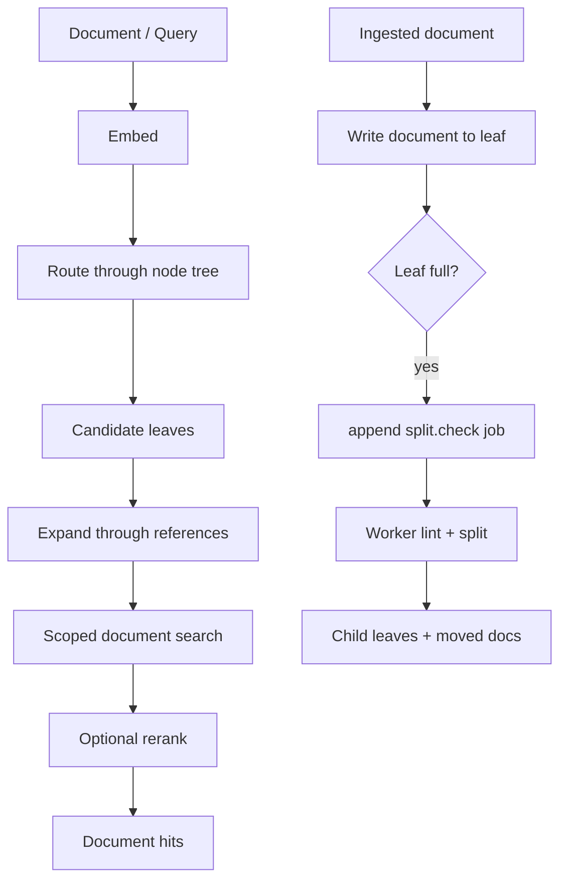

# Alexandria

Alexandria is a dynamic semantic index for document collections. It stores
documents in a growing tree of semantic leaves, routes new documents and
queries through that tree, expands retrieval through learned leaf references,
and queues maintenance work when leaves become too dense.

The project is structured as a research-friendly system: the algorithmic
choices live in application use cases, while databases, provider clients,
workers, APIs, CLI commands, and MCP tools are adapters around those use cases.

## Core Idea

Most retrieval systems search one flat vector space. Alexandria instead keeps a
semantic routing tree:

- `Node` rows form a tree. Branch nodes route traversal; leaf nodes own
  documents.
- `Document` rows store body, summary, embedding, and the current owning leaf.
- `Reference` rows are directed semantic links between active leaves.
- `Job` rows form a durable outbox for asynchronous maintenance such as
  `split.check`.

The index starts as one root leaf. As documents accumulate, full leaves are
split into child leaves. Retrieval first routes to likely leaves, expands the
scope through references, then searches documents only inside that scoped set.



## Algorithmic Model

Alexandria separates three spaces:

- Routing space: node embeddings represent coarse semantic regions.
- Document space: document embeddings support local similarity search inside
  routed leaves.
- Reference space: leaf-to-leaf references recover nearby regions that tree
  routing alone might miss.

This gives the system two useful properties:

- Search cost can scale with selected leaves rather than the full corpus.
- Maintenance can be localized to overfull leaves instead of rebuilding a flat
  index.

The current implementation uses deterministic vector scoring in SQL-backed
infrastructure. BM25-style lexical scoring and provider-backed ranking are
planned extension points behind the `Search` and `Ranker` ports.

## Ingest

Ingest accepts a `DocIn`, summarizes it, embeds stable document text, routes it
to an active leaf, writes the document, updates the leaf count, and appends a
split-check job when the leaf reaches the configured fullness threshold.

Pseudo-flow:

```text
summarize(document)
embedding = embed(name + body)
root = seed()
candidates = route(embedding)
leaf = nearest active leaf
write Document(leaf, summary, body, embedding)
leaf.doc_count = count(leaf.documents)
if full(leaf):
    append Job(kind="split.check", key=leaf.id, payload={node_id})
commit
```

The document write, leaf count update, and outbox append share a unit of work
so durable data and queued maintenance stay consistent.

## Retrieval

Retrieval embeds the query, routes through the tree, expands candidate leaves
through references, searches documents inside the resulting scope, and applies
an optional reranker.

Pseudo-flow:

```text
query_embedding = embed(query)
routed = route(query_embedding, limit)
leaves = routed.leaf_ids
leaves += refs.near(leaves, query_embedding)
hits = search.find(query, query_embedding, leaves, limit)
return rerank(query, hits, limit)
```

Tree routing and document search are deliberately separate boundaries. Routing
chooses where to look; search scores documents inside that bounded scope.
References widen the scope but do not directly decide final document rank.

## Split Maintenance

When a leaf becomes full, ingest appends a durable `split.check` job. The worker
claims the job, calls the application lint boundary, and marks the job after the
workflow completes.

The split flow is intentionally conservative:

```text
claim split.check
reload node
skip if stale, inactive, branch, or no longer full
mark source leaf as splitting
call Splitter outside the write transaction
validate SplitPlan against current local document ids
create child leaves
move documents to assigned children
turn source leaf into a branch
clear stale outgoing references
commit
mark job
```

`SplitPlan` is treated as untrusted adapter output. The application layer
rejects unknown document ids, duplicate assignments, empty children, and plans
that leave local documents unassigned.

## Boundaries

The repository follows a small clean architecture:

- `domain`: durable entities and value enums.
- `application`: use cases, ports, and typed boundary shapes.
- `infrastructure`: SQL setup, repositories, unit of work, search, providers,
  observability, and outbox adapters.
- `presentation`: API, CLI, MCP, and worker entrypoints.

Application use cases own workflow decisions. Repositories persist and fetch.
Adapters translate provider or infrastructure details into application ports.
Entrypoints translate transport input into application calls.

## Current Status

Implemented core paths:

- SQL-backed nodes, documents, references, outbox, and unit of work.
- Seed, route, ingest, retrieve, rerank, refs, lint, and split use cases.
- OpenAI-compatible embedding adapter.
- LangChain-backed summarizer adapter.
- Deterministic SQL vector search over scoped leaves.
- API, CLI, MCP, worker, and smoke notebooks for main flows.

Active extension areas:

- Provider-backed splitter adapter.
- Provider-backed ranker adapter.
- BM25-style lexical scoring inside the `Search` adapter.
- Broader integration smoke coverage for public workflows.

## Running Locally

Create a local environment file from `.env.example`, then start infrastructure:

```bash
task deploy -- --wait
```

Common checks:

```bash
task lint
task test
```

Manual smoke notebooks live in `sandbox/` and exercise ingest, retrieval, and
split-check flows against local infrastructure.
