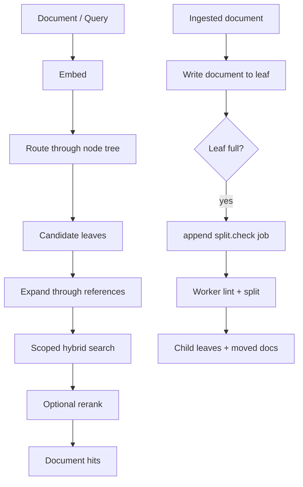

# Alexandria

Alexandria is a dynamic semantic index for document collections. It stores
documents in a growing tree of semantic leaves, routes documents and queries
through that tree, expands retrieval through directed leaf references, and
queues maintenance work when leaves become too dense.

The project keeps workflow decisions in application use cases. Databases,
provider clients, workers, APIs, CLI commands, and MCP tools are adapters around
those use cases.

## Core Model

- `Node` rows form the routing tree. Branch nodes route traversal; leaf nodes
  own documents.
- `Document` rows store body, summary, embedding, and the current owning leaf.
- `Reference` rows are directed semantic links between active leaves.
- `Job` rows form a durable outbox for asynchronous work such as `split.check`.

The index starts as one root leaf. Ingest attaches documents to active leaves
and appends split-check work when a leaf reaches the configured fullness
threshold. Retrieval routes to candidate leaves, expands through references,
then runs scoped hybrid search with BM25-style lexical scoring plus vector
similarity.



## Implemented Paths

- SQL-backed nodes, documents, references, outbox, and unit of work.
- Seed, route, ingest, retrieve, rerank, refs, lint, and split use cases.
- Deterministic hybrid search over scoped leaves.
- OpenAI-compatible embedding adapter.
- LangChain-backed summarizer, splitter, and ranker adapters.
- API, CLI, MCP, worker, and deterministic smoke notebooks for main flows.

Provider-backed embedding and summarization are required for real ingest and
retrieve workflows unless tests or notebooks inject fakes. Splitter and ranker
providers are optional and disabled by default.

## Local Setup

Install the local development loop:

```bash
cp .env.example .env
task setup
```

`task setup` syncs development dependencies, installs pre-commit and pre-push
hooks, then runs the local validation matrix through `task test`.

For real local app runs, start Postgres with pgvector:

```bash
task deploy -- --wait
```

Then start the API, MCP server, and worker:

```bash
task start
```

The Docker Compose infrastructure profile uses the database settings in
`.env.example`. The application currently uses `Db.create_all()` plus
`CREATE EXTENSION IF NOT EXISTS vector` during `App.setup()`; Alembic-style
migrations are not part of the local setup strategy yet.

## Validation

Run the full local and CI-equivalent matrix:

```bash
task test
```

`task test` runs lint/compile, pytest collection, application tests,
infrastructure tests, entrypoint tests, integration tests, and remaining
always-on domain/scaffold tests.

Focused commands are still useful while developing:

```bash
task lint
uv run pytest tests/integration/test_end_to_end_flow.py -q
uv run pytest tests/application -q
```

## Provider Configuration

The default real workflow adapters are OpenAI-compatible:

- `ALEXANDRIA_EMBEDDING__API_KEY` is required when ingest or retrieve needs an
  embedding.
- `ALEXANDRIA_SUMMARIZER__API_KEY` is required when ingest needs a summary.
- `ALEXANDRIA_SPLITTER__PROVIDER=none` disables provider-backed splitting by
  default. Set it to `openai` and provide `ALEXANDRIA_SPLITTER__API_KEY` to use
  the LangChain splitter adapter.
- `ALEXANDRIA_RANKER__PROVIDER=none` disables provider-backed reranking by
  default. Set it to `openai` and provide `ALEXANDRIA_RANKER__API_KEY` to use
  the LangChain ranker adapter.

Missing required provider config fails with typed infrastructure config errors
when the provider-backed path is used. Health/version metadata paths and
deterministic local tests do not require provider credentials.

## Public Workflows

- API: `GET /health`, `GET /version`, `POST /ingest`, `GET /retrieve`.
- CLI: `alexandria cli version`, `alexandria cli ingest`,
  `alexandria cli retrieve`, `alexandria cli refs`.
- MCP: `ingest` and `retrieve` tools over the streamable HTTP transport.
- Worker: claims `split.check` jobs and calls the application lint boundary.

Manual smoke notebooks live in `sandbox/`. `sandbox/06_end_to_end.ipynb`
demonstrates the full deterministic local lifecycle without live provider
calls.
