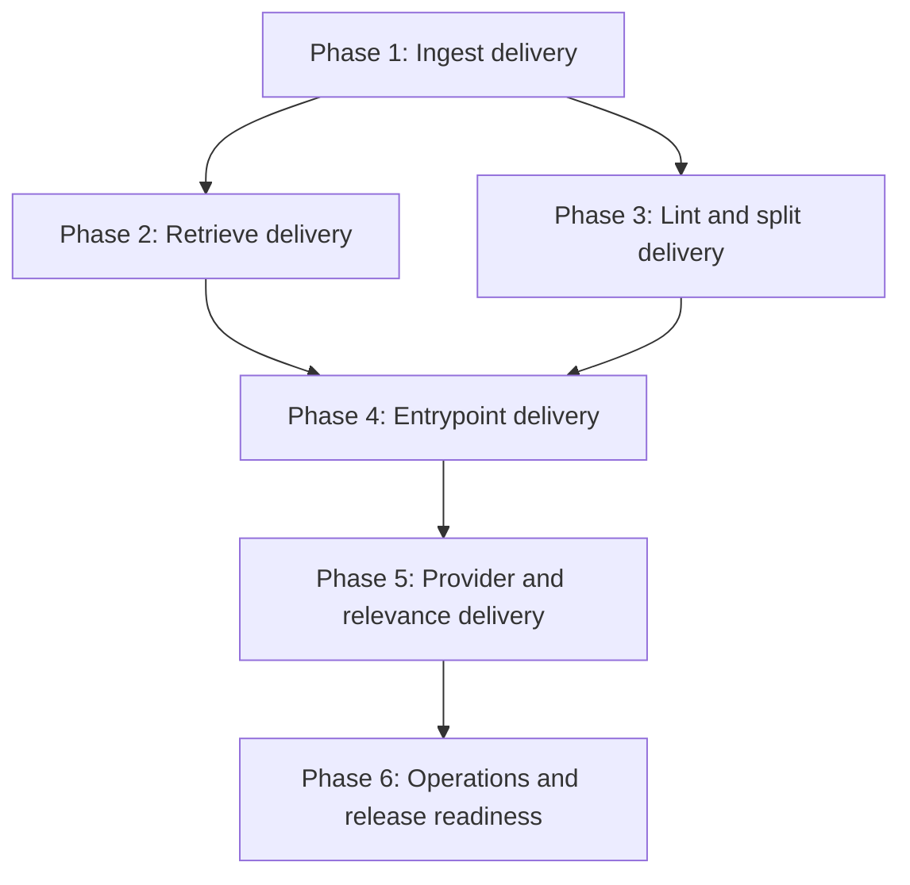
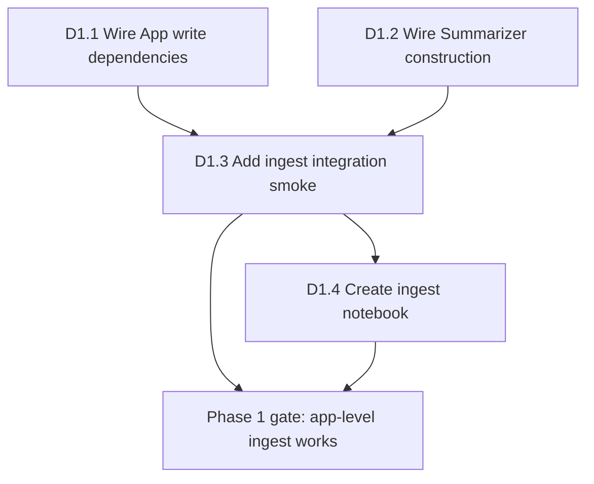
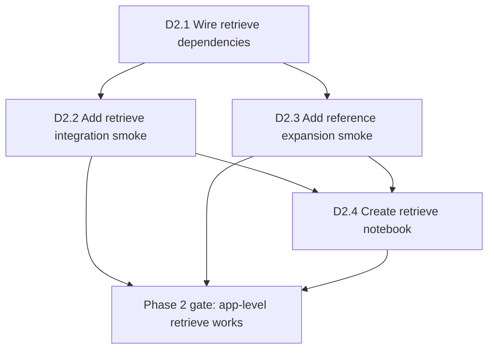
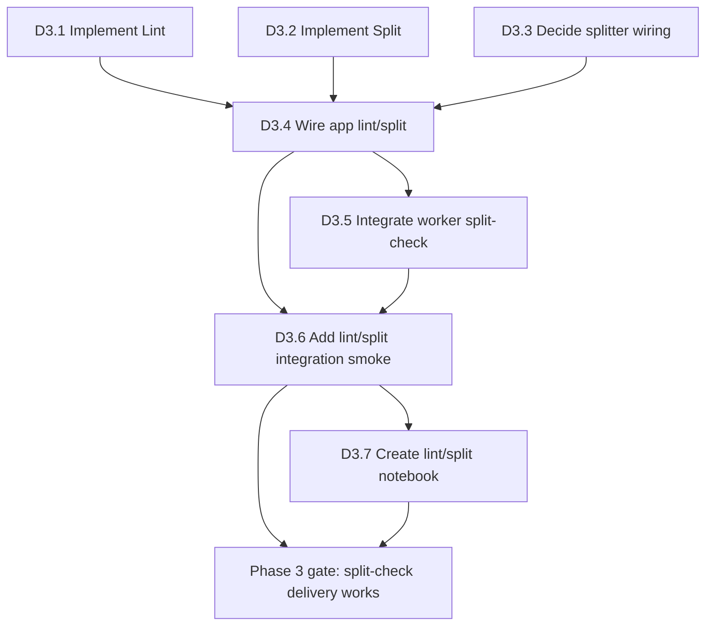
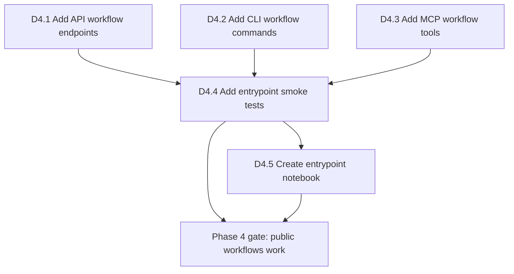
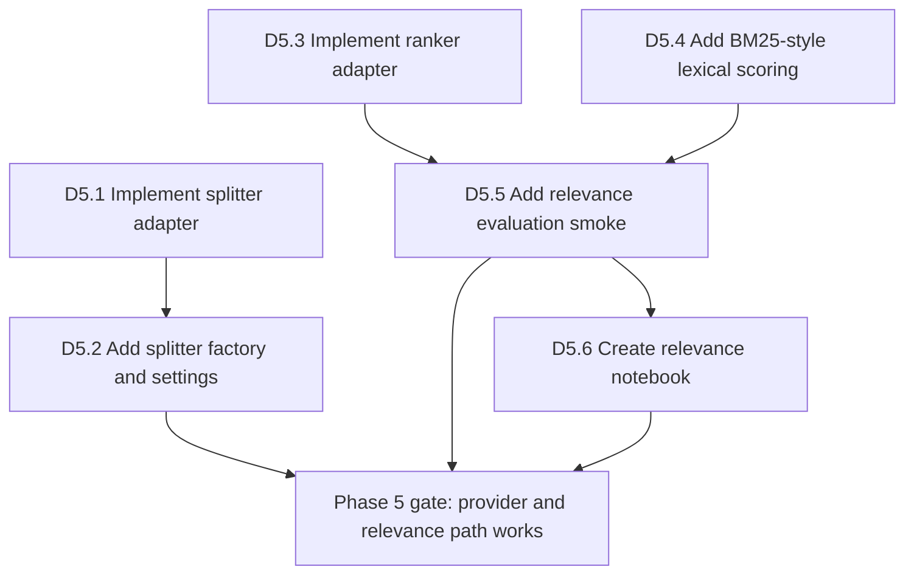
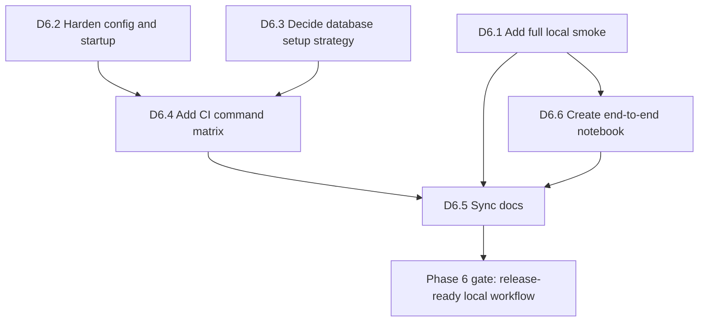

# Alexandria Delivery Plan

This plan divides the remaining Alexandria work into major delivery phases.
Each task is written as a copy-paste implementation prompt with the same
structure:

- task title
- required context loading
- prerequisite
- scope
- behavior
- validation

Every major delivery must include:

- focused unit tests for changed behavior
- an integration or smoke test through a realistic boundary
- a notebook with deterministic local data
- documentation updates when architecture, workflow, public behavior, or
  validation obligations change

## Current Baseline

Already present:

- SQLAlchemy shared-kernel entities for nodes, documents, references, and jobs
- repositories for nodes, documents, references, and outbox
- persistence `Db` and `SqlUnitOfWork`
- application ports and result shapes
- implemented `Seed`, `Route`, `Ingest`, `Refs`, `Retrieve`, and `Rerank`
- deterministic `SqlSearch`
- OpenAI embedder adapter and LangChain summarizer adapter
- worker shell for outbox jobs
- health/version API shell, limited CLI shell, placeholder MCP shell

Known gaps:

- `Lint` and `Split` are still stubs
- `App` does not fully wire UoW-backed use cases, search, refs, summarizer, or
  splitter dependencies
- worker split-check payload validation and split-job behavior need tests
- API, CLI, and MCP do not expose the main ingest, retrieve, and lint workflows
- notebooks and integration smoke tests are missing for major deliveries
- provider-backed splitter/ranker and BM25-style lexical scoring are not yet
  complete

## Known Gap Task Index

Every known gap above is tracked by one or more explicit task prompts below.
Use this index when choosing the next task.

- `Lint` and `Split` are still stubs.
  - Tracked by: D3.1 `Implement Lint`, D3.2 `Implement Split`.
  - Delivery: Phase 3.

- `App` does not fully wire UoW-backed use cases, search, refs, summarizer, or
  splitter dependencies.
  - Tracked by: D1.1 `Wire App Write Dependencies`, D1.2 `Wire Summarizer
    Construction`, D2.1 `Wire Retrieve Dependencies`, D3.3 `Decide Splitter
    Wiring`, D3.4 `Wire App Lint And Split`, D5.2 `Add Splitter Factory And
    Settings`.
  - Delivery: Phases 1, 2, 3, and 5.

- Worker split-check payload validation and split-job behavior need tests.
  - Tracked by: D3.5 `Integrate Worker Split-Check`, D3.6 `Add Lint/Split
    Integration Smoke`.
  - Delivery: Phase 3.

- API, CLI, and MCP do not expose the main ingest, retrieve, and lint
  workflows.
  - Tracked by: D4.1 `Add API Workflow Endpoints`, D4.2 `Add CLI Workflow
    Commands`, D4.3 `Add MCP Workflow Tools`, D4.4 `Add Entrypoint Smoke
    Tests`.
  - Delivery: Phase 4.

- Notebooks and integration smoke tests are missing for major deliveries.
  - Tracked by: D1.3, D1.4, D2.2, D2.3, D2.4, D3.6, D3.7, D4.4, D4.5, D5.5,
    D5.6, D6.1, and D6.6.
  - Delivery: Every phase.

- Provider-backed splitter/ranker and BM25-style lexical scoring are not yet
  complete.
  - Tracked by: D5.1 `Implement Splitter Adapter`, D5.2 `Add Splitter Factory
    And Settings`, D5.3 `Implement Ranker Adapter`, D5.4 `Add BM25-Style
    Lexical Scoring`, D5.5 `Add Relevance Evaluation Smoke`.
  - Delivery: Phase 5.

Gap dependency graph:

```mermaid
flowchart TD
    G1["Gap: Lint/Split stubs"] --> D31["D3.1 Implement Lint"]
    G1 --> D32["D3.2 Implement Split"]

    G2["Gap: App wiring incomplete"] --> D11["D1.1 Wire App write dependencies"]
    G2 --> D12["D1.2 Wire Summarizer construction"]
    G2 --> D21["D2.1 Wire retrieve dependencies"]
    G2 --> D33["D3.3 Decide splitter wiring"]
    G2 --> D34["D3.4 Wire app lint/split"]
    G2 --> D52["D5.2 Add splitter factory and settings"]

    G3["Gap: Worker split-check untested"] --> D35["D3.5 Integrate worker split-check"]
    G3 --> D36["D3.6 Add lint/split integration smoke"]

    G4["Gap: Entrypoints missing workflows"] --> D41["D4.1 Add API workflow endpoints"]
    G4 --> D42["D4.2 Add CLI workflow commands"]
    G4 --> D43["D4.3 Add MCP workflow tools"]
    G4 --> D44["D4.4 Add entrypoint smoke tests"]

    G5["Gap: Smoke tests and notebooks missing"] --> D13["D1.3 Add ingest integration smoke"]
    G5 --> D14["D1.4 Create ingest notebook"]
    G5 --> D22["D2.2 Add retrieve integration smoke"]
    G5 --> D23["D2.3 Add reference expansion smoke"]
    G5 --> D24["D2.4 Create retrieve notebook"]
    G5 --> D36["D3.6 Add lint/split integration smoke"]
    G5 --> D37["D3.7 Create lint/split notebook"]
    G5 --> D44["D4.4 Add entrypoint smoke tests"]
    G5 --> D45["D4.5 Create entrypoint notebook"]
    G5 --> D55["D5.5 Add relevance evaluation smoke"]
    G5 --> D56["D5.6 Create relevance notebook"]
    G5 --> D61["D6.1 Add full local smoke"]
    G5 --> D66["D6.6 Create end-to-end notebook"]

    G6["Gap: Provider and relevance incomplete"] --> D51["D5.1 Implement splitter adapter"]
    G6 --> D52b["D5.2 Add splitter factory and settings"]
    G6 --> D53["D5.3 Implement ranker adapter"]
    G6 --> D54["D5.4 Add BM25-style lexical scoring"]
    G6 --> D55b["D5.5 Add relevance evaluation smoke"]
```

## Overall Dependency Graph

## Phase 1: Ingest Delivery

Goal: `App.ingest(DocIn(...))` can create or reuse the root, summarize and
embed one document through configured ports, persist it to a leaf, update leaf
count, and append `split.check` when the leaf is full.

Phase gate:

- app-level ingest wiring is complete
- focused ingest and app-wiring tests pass
- `tests/integration/test_ingest_flow.py` proves local deterministic ingest
  persists node, document, and split-check job when the threshold is reached
- `notebooks/01_ingest_smoke.ipynb` demonstrates the same flow

Phase diagram:

Parallelism: D1.1 and D1.2 can run in parallel. D1.3 and D1.4 must wait until
the app-level ingest boundary is wired.

### D1.1 Wire App Write Dependencies [DONE]

Implement `App` write dependency wiring.

Load and follow `docs/rules.md`, `docs/workflows.md`, `docs/architecture.md`,
and `docs/tests.md` before planning or editing. Inspect the worktree first and
preserve unrelated local changes.

Prerequisite:

- `Seed`, `Ingest`, and `Refs` should already be implemented.
- `SqlUnitOfWork` should live under `src/infrastructure/persistence/`.
- If any write use case is still a stub, report it before editing app wiring.

Scope:

- Update `src/application/app.py`.
- Update `tests/application/test_app.py`.
- Use `Db.sessions()` to construct `SqlUnitOfWork`.
- Do not implement use-case behavior inside `App`.
- Do not add API, CLI, MCP, worker, or provider-adapter behavior.

Behavior:

- Construct the concrete repositories needed by read-only use cases.
- Construct `SqlUnitOfWork` from the persistence session factory.
- Wire `Seed` with UoW.
- Wire `Ingest` with UoW, embedder, summarizer placeholder or configured
  summarizer, seed, route, and `settings.ingest.max_leaf_docs`.
- Wire `Refs` with UoW.
- Leave `Lint` and `Split` wiring explicit but safe if they are still stubs.
- Keep `App` as a thin facade and dependency factory.
- App construction must remain testable with fakes.

Validation:

- `python3 -m compileall src tests`
- `uv run pytest tests/application/test_app.py -q`

### D1.2 Wire Summarizer Construction [DONE]

Implement `Summarizer` construction and app wiring.

Load and follow `docs/rules.md`, `docs/workflows.md`, `docs/architecture.md`,
and `docs/tests.md` before planning or editing. Inspect the worktree first and
preserve unrelated local changes.

Prerequisite:

- `LangSummarizer` should already implement the `Summarizer` port.
- If no chat-model settings exist for summarization, choose the smallest
  explicit config shape or report the config gap before editing.

Scope:

- Update `src/application/app.py`.
- Update `src/infrastructure/config.py` if settings are needed.
- Add or update infrastructure factory code only if it keeps provider-client
  construction in infrastructure.
- Add tests in the nearest existing app or infrastructure test file.
- Do not make unit tests call real providers.

Behavior:

- Normal app wiring should not leave `Ingest.summarizer` as `None`.
- Missing optional provider credentials should fail at the point of use or
  deliberate adapter construction with a typed infrastructure/config error.
- Local tests must be able to inject a deterministic summarizer without API
  keys or network calls.
- Keep provider SDK imports out of application use cases.

Validation:

- `python3 -m compileall src tests`
- `uv run pytest tests/application/test_app.py tests/infrastructure/agents/test_summarizer.py -q`

### D1.3 Add Ingest Integration Smoke

Implement `tests/integration/test_ingest_flow.py`.

Load and follow `docs/rules.md`, `docs/workflows.md`, `docs/architecture.md`,
and `docs/tests.md` before planning or editing. Inspect the worktree first and
preserve unrelated local changes.

Prerequisite:

- App-level ingest wiring should be complete.
- Deterministic fake embedder and summarizer behavior must be available in the
  test or shared fakes.

Scope:

- Add `tests/integration/test_ingest_flow.py`.
- Use deterministic local fakes for external provider ports.
- Use a local test database/session setup consistent with existing repository
  tests.
- Do not depend on network or provider credentials.

Behavior:

- Arrange settings with a small `ingest.max_leaf_docs` threshold.
- Call the public app boundary or the fully wired application boundary.
- Ingest one or more deterministic `DocIn` values.
- Assert root/leaf state exists.
- Assert the document row exists with name, body, summary, source key, and
  embedding.
- Assert `doc_count` is updated consistently.
- Assert a `split.check` outbox job is appended when the threshold is reached.
- Assert the outbox key is the leaf node id.

Validation:

- `python3 -m compileall src tests`
- `uv run pytest tests/integration/test_ingest_flow.py -q`

### D1.4 Create Ingest Notebook

Create `notebooks/01_ingest_smoke.ipynb`.

Load and follow `docs/rules.md`, `docs/workflows.md`, `docs/architecture.md`,
and `docs/tests.md` before planning or editing. Inspect the worktree first and
preserve unrelated local changes.

Prerequisite:

- `tests/integration/test_ingest_flow.py` should pass.
- If notebooks do not have an established directory, create `notebooks/`.

Scope:

- Add `notebooks/01_ingest_smoke.ipynb`.
- Use deterministic local fakes for external providers.
- Do not make the notebook the only validation for ingest behavior.

Behavior:

- Show setup for deterministic local settings and dependencies.
- Ingest at least one document.
- Inspect persisted node, document, and outbox state.
- Include expected output notes in markdown cells.
- Include the matching pytest smoke command in a final markdown cell.

Validation:

- `python3 -m compileall src tests`
- `uv run pytest tests/integration/test_ingest_flow.py -q`

## Phase 2: Retrieve Delivery

Goal: `App.retrieve(query)` can embed the query, route to leaves, expand
references when configured, search scoped documents through `Search`, and
return deterministic ranked `DocHit` values.

Phase gate:

- app-level retrieve wiring is complete
- retrieve and search tests pass
- `tests/integration/test_retrieve_flow.py` proves an ingested local document
  can be retrieved through the app boundary
- `notebooks/02_retrieve_smoke.ipynb` demonstrates ingest plus retrieve

Phase diagram:

Parallelism: D2.2 and D2.3 can run in parallel after D2.1. D2.4 should follow
the smoke tests.

### D2.1 Wire Retrieve Dependencies

Implement `App` retrieve dependency wiring.

Load and follow `docs/rules.md`, `docs/workflows.md`, `docs/architecture.md`,
and `docs/tests.md` before planning or editing. Inspect the worktree first and
preserve unrelated local changes.

Prerequisite:

- `Retrieve`, `Route`, `Refs`, `Rerank`, and `SqlSearch` should already be
  implemented.
- If `SqlSearch` or `Retrieve` is missing, report the missing prerequisite
  before editing app wiring.

Scope:

- Update `src/application/app.py`.
- Update `tests/application/test_app.py`.
- Use `SqlSearch` and `ReferenceRepo` for retrieve wiring.
- Do not add API, CLI, MCP, worker, or provider-ranker behavior.

Behavior:

- Construct `SqlSearch` with the app session.
- Construct `ReferenceRepo` with the app session or through the configured UoW
  pattern if the app wiring has moved fully to scoped units of work.
- Wire `Retrieve` with embedder, route, search, refs, and rerank.
- Remove normal `search=None` and `refs=None` placeholders.
- Preserve `App.retrieve(query, limit)` as a thin facade over the use case.

Validation:

- `python3 -m compileall src tests`
- `uv run pytest tests/application/test_app.py tests/application/usecases/test_retrieve.py tests/infrastructure/test_search.py -q`

### D2.2 Add Retrieve Integration Smoke

Implement `tests/integration/test_retrieve_flow.py`.

Load and follow `docs/rules.md`, `docs/workflows.md`, `docs/architecture.md`,
and `docs/tests.md` before planning or editing. Inspect the worktree first and
preserve unrelated local changes.

Prerequisite:

- App-level ingest and retrieve wiring should be complete.
- Deterministic fake embedder/summarizer behavior must be available.

Scope:

- Add `tests/integration/test_retrieve_flow.py`.
- Use deterministic local data and local persistence.
- Do not call real provider services.

Behavior:

- Arrange at least one persisted document through ingest or deterministic
  fixtures.
- Call `App.retrieve(...)`.
- Assert returned `DocHit` document identity.
- Assert stable score ordering.
- Assert retrieval goes through route plus scoped search, not direct
  `DocumentRepo` ranking.
- Include a no-results case for unmatched or empty leaf scope if practical.

Validation:

- `python3 -m compileall src tests`
- `uv run pytest tests/integration/test_retrieve_flow.py -q`

### D2.3 Add Reference Expansion Smoke

Implement reference expansion coverage for retrieve.

Load and follow `docs/rules.md`, `docs/workflows.md`, `docs/architecture.md`,
and `docs/tests.md` before planning or editing. Inspect the worktree first and
preserve unrelated local changes.

Prerequisite:

- `Refs` and `Retrieve` should be implemented and wired.
- `ReferenceRepo.near(...)` should already have repository-level coverage.

Scope:

- Add coverage to `tests/integration/test_retrieve_flow.py` or a focused
  companion integration test.
- Use deterministic local persistence.
- Do not alter `DocumentRepo` to support retrieval ranking.

Behavior:

- Arrange a routed source leaf and a referenced target leaf.
- Put a document in the referenced target leaf.
- Call retrieve with a query that routes to the source leaf.
- Assert retrieve expands candidate leaves through references.
- Assert the target leaf document can be returned.
- Assert reference expansion widens scope only and does not replace final
  search/rerank ordering.

Validation:

- `python3 -m compileall src tests`
- `uv run pytest tests/integration/test_retrieve_flow.py -q`

### D2.4 Create Retrieve Notebook

Create `notebooks/02_retrieve_smoke.ipynb`.

Load and follow `docs/rules.md`, `docs/workflows.md`, `docs/architecture.md`,
and `docs/tests.md` before planning or editing. Inspect the worktree first and
preserve unrelated local changes.

Prerequisite:

- `tests/integration/test_retrieve_flow.py` should pass.

Scope:

- Add `notebooks/02_retrieve_smoke.ipynb`.
- Use deterministic local fakes for external providers.
- Do not require network access.

Behavior:

- Demonstrate local setup.
- Ingest or arrange documents.
- Optionally build references.
- Retrieve with at least two queries.
- Inspect returned `DocHit` scores and document ids.
- Include the matching pytest smoke command in a final markdown cell.

Validation:

- `python3 -m compileall src tests`
- `uv run pytest tests/integration/test_retrieve_flow.py -q`

## Phase 3: Lint And Split Delivery

Goal: the split-check workflow can reload a queued node, skip stale work, split
an active full leaf with validated adapter output, move documents, clear stale
references, and commit the durable change.

Phase gate:

- focused `Lint` and `Split` tests pass
- app or worker-level split-check integration test proves one full leaf becomes
  split children with documents redistributed
- `notebooks/03_lint_split_smoke.ipynb` demonstrates the flow

Phase diagram:

Parallelism: D3.1, D3.2, and D3.3 can run in parallel if their contracts are
agreed upfront. D3.5 starts after D3.4.

### D3.1 Implement Lint

Implement `Lint`.

Load and follow `docs/rules.md`, `docs/workflows.md`, `docs/architecture.md`,
and `docs/tests.md` before planning or editing. Inspect the worktree first and
preserve unrelated local changes.

Prerequisite:

- `Split` may still be a stub, but `Lint` must be able to delegate to a fake
  `Split` in tests.
- Use the configured `Settings.ingest.max_leaf_docs` or an explicitly injected
  fullness threshold. Do not invent hidden fullness policy.

Scope:

- Implement `src/application/usecases/lint.py`.
- Add tests in `tests/application/usecases/test_lint.py`.
- Use application ports only: `UnitOfWork` and `Split`.
- Do not implement split behavior here.
- Do not add worker, app wiring, API, CLI, MCP, or concrete infrastructure
  behavior.

Behavior:

- If `uow` is missing, raise a clear application-layer error.
- If `split` is missing, raise a clear application-layer error.
- Load the node with `await uow.nodes.get(node_id)`.
- If the node is missing, return without committing.
- If the node is not active, return without committing.
- If the node is not a leaf, return without committing.
- If the node is not full by the explicit fullness policy, return without
  committing.
- Only when the node is an active full leaf, call `await split.run(node_id)`.
- Do not perform repository-level split decisions beyond the eligibility check.
- Do not mutate durable state in `Lint`; `Split` owns the durable split
  workflow.

Validation:

- `python3 -m compileall src tests`
- `uv run pytest tests/application/usecases/test_lint.py -q`

### D3.2 Implement Split

Implement `Split`.

Load and follow `docs/rules.md`, `docs/workflows.md`, `docs/architecture.md`,
and `docs/tests.md` before planning or editing. Inspect the worktree first and
preserve unrelated local changes.

Prerequisite:

- `Refs` should already be implemented or its reference-rebuild follow-up should
  be left as a narrow documented TODO.
- If the repo has no explicit follow-up job kind for reference rebuilds, do not
  invent one silently; report the gap or leave a small TODO in the
  implementation.

Scope:

- Implement `src/application/usecases/split.py`.
- Add tests in `tests/application/usecases/test_split.py`.
- Use application ports only: `UnitOfWork` and `Splitter`.
- Use domain entities such as `Node` and `Reference` as needed.
- Do not add worker, app wiring, API, CLI, MCP, or concrete infrastructure
  behavior.

Behavior:

- If `uow` is missing, raise a clear application-layer error.
- If `splitter` is missing, raise a clear application-layer error.
- Load the source node with `await uow.nodes.get(node_id)`.
- If the source node is missing, not active, or not a leaf, return without
  committing.
- Load local documents for the leaf with `await uow.docs.leaf(node_id)`.
- If there are no documents, return without committing.
- Call `await splitter.split(source, docs)`.
- Treat `SplitPlan` as untrusted adapter output.
- Validate child assignments against local document ids.
- Reject unknown document ids.
- Reject duplicate document assignments.
- Reject plans that leave local documents unassigned.
- Reject empty child lists or children with empty document assignments.
- Create child leaf nodes from the validated child plans.
- Move documents to their assigned child leaves.
- Update the source node state according to the architecture docs.
- Clear stale outgoing references for the split source with
  `uow.refs.clear(source.id)`.
- Queue follow-up reference rebuild work only if there is an explicit existing
  job kind/policy; otherwise leave a narrow TODO and do not invent a broad queue
  contract.
- Commit durable changes through `await uow.commit()` once after all writes are
  staged.
- Do not hold a transaction open around any external LLM/provider call if the
  current UoW design allows separating read and write phases; if not, keep the
  implementation minimal and document the risk.

Validation:

- `python3 -m compileall src tests`
- `uv run pytest tests/application/usecases/test_split.py -q`

### D3.3 Decide Splitter Wiring

Implement the splitter wiring decision.

Load and follow `docs/rules.md`, `docs/workflows.md`, `docs/architecture.md`,
and `docs/tests.md` before planning or editing. Inspect the worktree first and
preserve unrelated local changes.

Prerequisite:

- `Split` should define clear behavior for missing `splitter`.
- If no concrete splitter adapter exists yet, this task may intentionally choose
  injection-only wiring and defer the adapter to Phase 5.

Scope:

- Update `src/application/app.py` and tests as needed.
- Update `src/infrastructure/config.py` only if a small explicit setting is
  required.
- Do not implement a provider-backed splitter here unless the task is explicitly
  expanded.

Behavior:

- Make the split dependency state explicit in app wiring.
- If no concrete splitter is configured, `App.split(...)` or `Split.run(...)`
  should fail clearly through an application-layer error.
- Tests should prove that app construction does not hide a `None` splitter for
  execution paths.
- If a fake splitter is injected in tests or notebooks, preserve that path.

Validation:

- `python3 -m compileall src tests`
- `uv run pytest tests/application/test_app.py tests/application/usecases/test_split.py -q`

### D3.4 Wire App Lint And Split

Implement `App` lint/split wiring.

Load and follow `docs/rules.md`, `docs/workflows.md`, `docs/architecture.md`,
and `docs/tests.md` before planning or editing. Inspect the worktree first and
preserve unrelated local changes.

Prerequisite:

- `Lint` and `Split` should be implemented or have explicit missing-dependency
  errors.
- App UoW wiring should already exist.

Scope:

- Update `src/application/app.py`.
- Update `tests/application/test_app.py`.
- Do not add worker, API, CLI, MCP, or provider adapter behavior.

Behavior:

- Wire `Lint` with UoW, split use case, and explicit fullness policy.
- Wire `Split` with UoW and splitter dependency.
- Preserve `App.lint(node_id)` and `App.split(node_id)` as thin facade methods.
- App wiring tests should assert that `lint_case` delegates to the configured
  `split_case`.

Validation:

- `python3 -m compileall src tests`
- `uv run pytest tests/application/test_app.py tests/application/usecases/test_lint.py tests/application/usecases/test_split.py -q`

### D3.5 Integrate Worker Split-Check

Implement worker split-check behavior.

Load and follow `docs/rules.md`, `docs/workflows.md`, `docs/architecture.md`,
and `docs/tests.md` before planning or editing. Inspect the worktree first and
preserve unrelated local changes.

Prerequisite:

- `Lint` and `Split` must be implemented.
- `App` should expose a working `lint(node_id)` facade method.

Scope:

- Update `src/presentation/worker/app.py` only if needed.
- Add or update worker tests under `tests/entrypoints/` or a worker-specific
  test file.
- Do not move split decisions into the worker.
- Do not call repositories directly from the worker for split decisions.

Behavior:

- Worker claims `split.check` jobs through the current outbox API.
- Worker extracts and validates `node_id` from the job payload.
- Worker calls `app.lint(node_id)`.
- On success, mark the job done.
- On expected application failure, mark the job failed with useful error text.
- On malformed payload, mark the job failed without calling `app.lint`.
- Preserve retry behavior through existing outbox `mark` semantics.
- Keep worker orchestration thin: claim -> app boundary -> mark.
- Avoid sleeps or long-running loops in unit tests.

Validation:

- `python3 -m compileall src tests`
- `uv run pytest tests/entrypoints -q`
- `uv run pytest --collect-only -q`

### D3.6 Add Lint/Split Integration Smoke

Implement `tests/integration/test_lint_split_flow.py`.

Load and follow `docs/rules.md`, `docs/workflows.md`, `docs/architecture.md`,
and `docs/tests.md` before planning or editing. Inspect the worktree first and
preserve unrelated local changes.

Prerequisite:

- `Lint`, `Split`, and app lint/split wiring should be complete.
- A deterministic fake splitter should be available in the test.

Scope:

- Add `tests/integration/test_lint_split_flow.py`.
- Use deterministic local persistence and fake splitter output.
- Include worker batch behavior only if D3.5 is complete.

Behavior:

- Arrange a full active leaf with multiple documents.
- Arrange a valid split plan assigning every local document exactly once.
- Run `App.lint(...)` or one worker batch.
- Assert child nodes are created.
- Assert documents moved to assigned child leaves.
- Assert parent/source node state matches architecture decisions.
- Assert stale outgoing references are cleared.
- If worker is included, assert the split-check job is marked done on success.

Validation:

- `python3 -m compileall src tests`
- `uv run pytest tests/integration/test_lint_split_flow.py -q`

### D3.7 Create Lint/Split Notebook

Create `notebooks/03_lint_split_smoke.ipynb`.

Load and follow `docs/rules.md`, `docs/workflows.md`, `docs/architecture.md`,
and `docs/tests.md` before planning or editing. Inspect the worktree first and
preserve unrelated local changes.

Prerequisite:

- `tests/integration/test_lint_split_flow.py` should pass.

Scope:

- Add `notebooks/03_lint_split_smoke.ipynb`.
- Use deterministic local fakes and local data.
- Do not require real provider calls.

Behavior:

- Demonstrate a full leaf with documents.
- Show the fake split plan.
- Run lint/split through the app or worker boundary.
- Inspect child nodes, moved documents, parent state, and outbox/job state when
  applicable.
- Include the matching pytest smoke command in a final markdown cell.

Validation:

- `python3 -m compileall src tests`
- `uv run pytest tests/integration/test_lint_split_flow.py -q`

## Phase 4: Entrypoint Delivery

Goal: the main app workflows are reachable through API, CLI, and MCP surfaces
without moving business decisions out of application use cases.

Phase gate:

- API, CLI, and MCP tests pass with fake app dependencies
- one integration smoke test exercises at least API ingest and retrieve
- `notebooks/04_entrypoints_smoke.ipynb` demonstrates the public surface

Phase diagram:

Parallelism: D4.1, D4.2, and D4.3 can run in parallel after app-level ingest,
retrieve, and lint/split are stable.

### D4.1 Add API Workflow Endpoints

Implement API workflow endpoints.

Load and follow `docs/rules.md`, `docs/workflows.md`, `docs/architecture.md`,
and `docs/tests.md` before planning or editing. Inspect the worktree first and
preserve unrelated local changes.

Prerequisite:

- `App.ingest(...)` and `App.retrieve(...)` should work through app-level smoke
  tests.
- `App.lint(...)` should work if adding a lint endpoint.

Scope:

- Update `src/presentation/api/app.py`.
- Add tests under `tests/entrypoints/`.
- Add request/response schemas for ingest and retrieve.
- Add refs/lint endpoints only if needed for the product surface.

Behavior:

- Keep API as a transport adapter over `App`.
- Translate request payloads into application boundary values.
- Translate application errors into appropriate transport responses.
- Do not import repositories or infrastructure adapters for workflow decisions.
- Preserve `/health` and `/version`.
- Tests should use fake app dependencies or FastAPI test clients without
  starting long-running servers.

Validation:

- `python3 -m compileall src tests`
- `uv run pytest tests/entrypoints -q`

### D4.2 Add CLI Workflow Commands

Implement CLI workflow commands.

Load and follow `docs/rules.md`, `docs/workflows.md`, `docs/architecture.md`,
and `docs/tests.md` before planning or editing. Inspect the worktree first and
preserve unrelated local changes.

Prerequisite:

- `App.ingest(...)`, `App.retrieve(...)`, and `App.refs(...)` should have stable
  return contracts.

Scope:

- Update `src/presentation/cli/app.py`.
- Add tests under `tests/entrypoints/`.
- Do not change application use-case behavior.

Behavior:

- Add `ingest` and `retrieve` commands.
- Add `lint` or `worker` commands only if needed for the product surface.
- Fix existing `refs` command output so it matches the current `App.refs(...)`
  return contract.
- Validate user input such as UUIDs and limits at the CLI boundary.
- Translate application errors into `click.ClickException`.
- Keep formatting in CLI and decisions in application use cases.

Validation:

- `python3 -m compileall src tests`
- `uv run pytest tests/entrypoints -q`

### D4.3 Add MCP Workflow Tools

Implement MCP workflow tools.

Load and follow `docs/rules.md`, `docs/workflows.md`, `docs/architecture.md`,
and `docs/tests.md` before planning or editing. Inspect the worktree first and
preserve unrelated local changes.

Prerequisite:

- App facade methods for ingest and retrieve should be stable.
- If MCP framework details are missing from the repo, inspect installed
  dependencies and use the smallest existing MCP pattern.

Scope:

- Update `src/presentation/mcp/app.py`.
- Add tests under `tests/entrypoints/`.
- Do not implement application decisions in MCP code.

Behavior:

- Replace placeholder output with MCP tools for core workflows.
- Translate MCP tool input into app facade calls.
- Return typed tool results suitable for clients.
- Validate input at the MCP boundary.
- Translate application errors to tool errors without losing useful messages.

Validation:

- `python3 -m compileall src tests`
- `uv run pytest tests/entrypoints -q`

### D4.4 Add Entrypoint Smoke Tests

Implement entrypoint smoke tests.

Load and follow `docs/rules.md`, `docs/workflows.md`, `docs/architecture.md`,
and `docs/tests.md` before planning or editing. Inspect the worktree first and
preserve unrelated local changes.

Prerequisite:

- API, CLI, and MCP workflow surfaces should be implemented or intentionally
  scoped out.

Scope:

- Add `tests/entrypoints/test_api.py`.
- Add `tests/entrypoints/test_cli.py`.
- Add `tests/entrypoints/test_mcp.py` if MCP is implemented.
- Add an integration companion only if a full public-boundary test is useful.

Behavior:

- Use fake app dependencies for entrypoint unit tests.
- Avoid starting long-running servers.
- Prove ingest and retrieve are reachable from public surfaces.
- Assert invalid input is rejected at the entrypoint boundary.
- Assert application errors are translated into user-facing errors.

Validation:

- `python3 -m compileall src tests`
- `uv run pytest tests/entrypoints -q`

### D4.5 Create Entrypoint Notebook

Create `notebooks/04_entrypoints_smoke.ipynb`.

Load and follow `docs/rules.md`, `docs/workflows.md`, `docs/architecture.md`,
and `docs/tests.md` before planning or editing. Inspect the worktree first and
preserve unrelated local changes.

Prerequisite:

- Entrypoint smoke tests should pass.

Scope:

- Add `notebooks/04_entrypoints_smoke.ipynb`.
- Demonstrate API or CLI usage against deterministic local data.
- Do not require provider network access.

Behavior:

- Show app setup or local command usage.
- Demonstrate ingest through a public boundary.
- Demonstrate retrieve through a public boundary.
- Show representative output.
- Include matching pytest commands in a final markdown cell.

Validation:

- `python3 -m compileall src tests`
- `uv run pytest tests/entrypoints -q`

## Phase 5: Provider And Relevance Delivery

Goal: the system can use real provider-backed adapters where configured while
retaining deterministic local tests and improving retrieval relevance beyond
vector-only scoring.

Phase gate:

- provider adapter tests pass with fake clients
- lexical/vector scoring tests pass
- `notebooks/05_relevance_eval.ipynb` compares deterministic retrieval outputs
  on a small local corpus

Phase diagram:

Parallelism: D5.1, D5.3, and D5.4 can run in parallel. D5.5 waits for whichever
relevance changes it is meant to verify.

### D5.1 Implement Splitter Adapter

Implement a concrete `Splitter` adapter.

Load and follow `docs/rules.md`, `docs/workflows.md`, `docs/architecture.md`,
and `docs/tests.md` before planning or editing. Inspect the worktree first and
preserve unrelated local changes.

Prerequisite:

- `Split` should already validate `SplitPlan` as untrusted output.
- If provider choice is undecided, add adapter seams and fake-client tests
  without hardwiring an unsupported provider.

Scope:

- Add an infrastructure adapter under `src/infrastructure/agents/` or another
  documented infrastructure path.
- Add tests under `tests/infrastructure/agents/`.
- Implement the `Splitter` port.
- Do not change split workflow decisions in application use cases.

Behavior:

- Keep provider SDK details in infrastructure.
- Request structured output compatible with `SplitPlan`.
- Validate structured provider output before returning it.
- Map provider/client failures to typed infrastructure errors.
- Tests should cover valid plans, malformed responses, empty plans, unknown
  fields, and provider failures using fake clients.

Validation:

- `python3 -m compileall src tests`
- `uv run pytest tests/infrastructure/agents -q`

### D5.2 Add Splitter Factory And Settings

Implement splitter factory and settings.

Load and follow `docs/rules.md`, `docs/workflows.md`, `docs/architecture.md`,
and `docs/tests.md` before planning or editing. Inspect the worktree first and
preserve unrelated local changes.

Prerequisite:

- A concrete splitter adapter or injection-only decision should exist.

Scope:

- Update `src/infrastructure/config.py`.
- Add or update an infrastructure factory file.
- Update `src/application/app.py` wiring.
- Add tests for settings/factory behavior.

Behavior:

- Add explicit splitter provider settings.
- Construct provider-backed splitters in infrastructure only.
- Let local tests inject fake splitters without provider credentials.
- App wiring should use a real splitter when configured.
- Missing splitter config should fail clearly when split execution is requested.

Validation:

- `python3 -m compileall src tests`
- `uv run pytest tests/application/test_app.py tests/infrastructure/agents -q`

### D5.3 Implement Ranker Adapter

Implement an optional `Ranker` adapter.

Load and follow `docs/rules.md`, `docs/workflows.md`, `docs/architecture.md`,
and `docs/tests.md` before planning or editing. Inspect the worktree first and
preserve unrelated local changes.

Prerequisite:

- `Rerank` should already work deterministically without a ranker.
- If product relevance does not need provider reranking yet, leave this task
  pending rather than weakening deterministic retrieval.

Scope:

- Add an infrastructure adapter for the `Ranker` port.
- Add provider settings/factory only if needed.
- Update app wiring only when configured.
- Add tests with fake provider clients.

Behavior:

- Keep provider SDK details in infrastructure.
- Accept query and candidate `DocHit` values.
- Return ranked `DocHit` values capped by limit.
- Reject or normalize provider output that references unknown documents.
- Preserve deterministic fallback when no ranker is configured.

Validation:

- `python3 -m compileall src tests`
- `uv run pytest tests/application/usecases/test_rerank.py tests/infrastructure/agents -q`

### D5.4 Add BM25-Style Lexical Scoring

Implement BM25-style lexical scoring in `Search`.

Load and follow `docs/rules.md`, `docs/workflows.md`, `docs/architecture.md`,
and `docs/tests.md` before planning or editing. Inspect the worktree first and
preserve unrelated local changes.

Prerequisite:

- `SqlSearch` should already implement deterministic scoped vector scoring.
- If database-specific lexical search is selected, document local test
  requirements before adding it.

Scope:

- Update `src/infrastructure/search.py`.
- Update `tests/infrastructure/test_search.py`.
- Do not move hybrid retrieval into `DocumentRepo`.
- Do not add LLM/provider calls.

Behavior:

- Scope every search to supplied leaf ids.
- Return `[]` for empty leaves or non-positive limit.
- Add deterministic lexical scoring over document body and summary.
- Combine lexical score and vector distance into a stable final score.
- Populate `DocHit.bm25` when lexical score is known.
- Preserve deterministic tie ordering.

Validation:

- `python3 -m compileall src tests`
- `uv run pytest tests/infrastructure/test_search.py -q`

### D5.5 Add Relevance Evaluation Smoke

Implement relevance evaluation smoke tests.

Load and follow `docs/rules.md`, `docs/workflows.md`, `docs/architecture.md`,
and `docs/tests.md` before planning or editing. Inspect the worktree first and
preserve unrelated local changes.

Prerequisite:

- Deterministic search should include the relevance behavior being evaluated.
- If ranker behavior is included, use fake provider clients.

Scope:

- Add `tests/integration/test_relevance_flow.py`.
- Use a small deterministic local corpus.
- Do not require network access.

Behavior:

- Arrange documents with known vector and lexical expectations.
- Run representative queries.
- Assert stable top results.
- Assert score component fields are populated as expected.
- Keep assertions robust enough to allow intentional scoring improvements.

Validation:

- `python3 -m compileall src tests`
- `uv run pytest tests/integration/test_relevance_flow.py -q`

### D5.6 Create Relevance Notebook

Create `notebooks/05_relevance_eval.ipynb`.

Load and follow `docs/rules.md`, `docs/workflows.md`, `docs/architecture.md`,
and `docs/tests.md` before planning or editing. Inspect the worktree first and
preserve unrelated local changes.

Prerequisite:

- `tests/integration/test_relevance_flow.py` should pass.

Scope:

- Add `notebooks/05_relevance_eval.ipynb`.
- Use a deterministic local corpus.
- Do not require network access by default.

Behavior:

- Show corpus setup.
- Show query set.
- Display scores, vector distance, lexical score, and final ranking.
- Include short notes explaining why each top result is expected.
- Include the matching pytest smoke command in a final markdown cell.

Validation:

- `python3 -m compileall src tests`
- `uv run pytest tests/integration/test_relevance_flow.py -q`

## Phase 6: Operations And Release Readiness

Goal: Alexandria can be installed, configured, smoked, and maintained without
depending on hidden local state.

Phase gate:

- full test collection passes
- focused unit and integration groups pass or external-service blockers are
  clearly documented
- `notebooks/06_end_to_end.ipynb` demonstrates the full local workflow
- docs accurately describe current commands and architecture

Phase diagram:

Parallelism: D6.1, D6.2, and D6.3 can run in parallel after phases 1-5 pass.
D6.5 should be last so it reflects the final state.

### D6.1 Add Full Local Smoke

Implement full local end-to-end smoke coverage.

Load and follow `docs/rules.md`, `docs/workflows.md`, `docs/architecture.md`,
and `docs/tests.md` before planning or editing. Inspect the worktree first and
preserve unrelated local changes.

Prerequisite:

- Ingest, retrieve, refs, lint, split, worker, and entrypoints should be
  implemented or intentionally scoped.

Scope:

- Add `tests/integration/test_end_to_end_flow.py`.
- Use deterministic local adapters.
- Do not require external services.

Behavior:

- Seed or initialize the index.
- Ingest multiple documents.
- Retrieve before split.
- Trigger or process split-check work.
- Retrieve after split.
- Assert durable state and observable results at each step.

Validation:

- `python3 -m compileall src tests`
- `uv run pytest tests/integration/test_end_to_end_flow.py -q`

### D6.2 Harden Config And Startup

Implement configuration and startup hardening.

Load and follow `docs/rules.md`, `docs/workflows.md`, `docs/architecture.md`,
and `docs/tests.md` before planning or editing. Inspect the worktree first and
preserve unrelated local changes.

Prerequisite:

- App wiring and provider settings should be mostly stable.

Scope:

- Update `src/infrastructure/config.py`.
- Update app startup paths only as needed.
- Add tests for settings construction and startup behavior.

Behavior:

- Missing optional providers should not break unrelated health/version flows
  unless the app explicitly requires them.
- Missing required providers should fail with typed errors at construction or
  point of use.
- Settings should be constructor-injected, not read ad hoc inside use cases.
- Local or memory-mode startup should remain testable.

Validation:

- `python3 -m compileall src tests`
- `uv run pytest tests/application/test_app.py tests/infrastructure -q`

### D6.3 Decide Database Setup Strategy

Implement or document the database setup strategy.

Load and follow `docs/rules.md`, `docs/workflows.md`, `docs/architecture.md`,
and `docs/tests.md` before planning or editing. Inspect the worktree first and
preserve unrelated local changes.

Prerequisite:

- Durable model shape should be stable enough for release-readiness planning.

Scope:

- Update persistence code only if needed.
- Update docs if `create_all` remains the strategy.
- Add migration tooling only if explicitly chosen.

Behavior:

- Decide whether `Db.create_all()` is sufficient for current release needs.
- If migrations are introduced, document commands and test setup impact.
- Preserve repository tests and local deterministic integration tests.
- Keep database setup out of application use-case decisions.

Validation:

- `python3 -m compileall src tests`
- `uv run pytest tests/infrastructure/persistence tests/infrastructure/repositories -q`

### D6.4 Add CI Command Matrix

Implement the CI and validation command matrix.

Load and follow `docs/rules.md`, `docs/workflows.md`, `docs/architecture.md`,
and `docs/tests.md` before planning or editing. Inspect the worktree first and
preserve unrelated local changes.

Prerequisite:

- The main local validation commands should be known.

Scope:

- Add or update CI config if present.
- Otherwise update documentation with the command matrix.
- Do not change test behavior just to satisfy CI without fixing the underlying
  issue.

Behavior:

- Include compile commands for `src` and `tests`.
- Include pytest collection.
- Include focused application, infrastructure, entrypoint, and integration
  groups.
- Document any external-service exclusions.
- Keep local and CI commands aligned.

Validation:

- `python3 -m compileall src tests`
- `uv run pytest --collect-only -q`

### D6.5 Sync Documentation

Update repository documentation for the final implemented state.

Load and follow `docs/rules.md`, `docs/workflows.md`, `docs/architecture.md`,
and `docs/tests.md` before planning or editing. Inspect the worktree first and
preserve unrelated local changes.

Prerequisite:

- Phases 1-5 and release-readiness decisions should be complete or explicitly
  marked as deferred.

Scope:

- Update `docs/architecture.md`.
- Update `docs/tests.md` if validation strategy changed.
- Update `README.md` if present.
- Update `delivery_plan.md` to mark completed/deferred tasks if desired.

Behavior:

- Reflect current adapters, app wiring, entrypoints, and durable workflows.
- Remove stale references to old module paths or stubs.
- Document smoke-test and notebook commands.
- Document known limitations and external-service requirements.
- Preserve document ownership rules from `AGENTS.md`.

Validation:

- `python3 -m compileall src tests`
- `uv run pytest --collect-only -q`
- `rg -n "repositories\\.db|repositories\\.unit_of_work|repositories\\.uow|NotImplementedError" docs README.md delivery_plan.md src tests`

### D6.6 Create End-To-End Notebook

Create `notebooks/06_end_to_end.ipynb`.

Load and follow `docs/rules.md`, `docs/workflows.md`, `docs/architecture.md`,
and `docs/tests.md` before planning or editing. Inspect the worktree first and
preserve unrelated local changes.

Prerequisite:

- `tests/integration/test_end_to_end_flow.py` should pass.

Scope:

- Add `notebooks/06_end_to_end.ipynb`.
- Use deterministic local adapters by default.
- Do not make the notebook the only end-to-end validation.

Behavior:

- Demonstrate the complete local lifecycle: seed, ingest, retrieve, refs,
  split-check processing, retrieve again.
- Inspect persisted state at meaningful points.
- Show expected outputs in markdown cells.
- Include commands for the corresponding pytest smoke test.

Validation:

- `python3 -m compileall src tests`
- `uv run pytest tests/integration/test_end_to_end_flow.py -q`

## Notebook Convention

Use a dedicated `notebooks/` directory for delivery notebooks:

- `notebooks/01_ingest_smoke.ipynb`
- `notebooks/02_retrieve_smoke.ipynb`
- `notebooks/03_lint_split_smoke.ipynb`
- `notebooks/04_entrypoints_smoke.ipynb`
- `notebooks/05_relevance_eval.ipynb`
- `notebooks/06_end_to_end.ipynb`

Notebook rules:

- default to deterministic local fakes for external providers
- make setup cells explicit and repeatable
- inspect durable state after writes
- include the matching pytest smoke command in a final markdown cell
- do not make notebooks the only validation for a behavior
