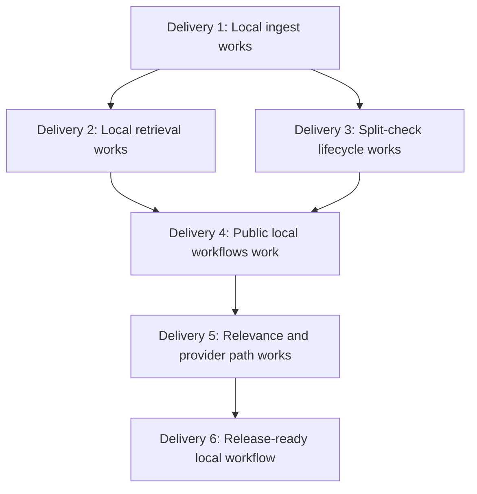

# Alexandria Delivery Plan

This plan is organized around working deliveries, not setup phases. Every
phase must end with a runnable local capability that can be demonstrated through
an intended boundary and verified by automated tests.

A delivery is not complete because wiring, scaffolding, or tests exist. A
delivery is complete only when a developer can run the named capability locally,
see the expected behavior, and validate it with the listed commands.

## Delivery Rules

- Each delivery ends with a working milestone.
- Each milestone must be reachable through a public or application boundary.
- Each delivery must include focused tests for the behavior it changes.
- Each delivery must include an integration or smoke test through a realistic boundary.
- Each delivery must include a deterministic notebook or walkthrough when it introduces a major workflow.
- Each delivery must keep external providers behind infrastructure adapters and local tests behind fakes.
- Each delivery must update docs when architecture, workflow, commands, or public behavior changes.
- Final evaluation for accepted work must include `task test`.

## Working Definition Of Done

A delivery is accepted when all of these are true:

- The milestone can be run locally without hidden state.
- The intended boundary works end to end for deterministic local data.
- Unit tests cover the changed use cases or adapters.
- A smoke or integration test proves the delivery behavior across boundaries.
- Validation commands pass, including `task test` for final evaluation.
- Any deferred behavior is explicit and does not make the milestone misleading.

## Current Product Baseline

Already present or partially present:

- SQLAlchemy shared-kernel entities for nodes, documents, references, and jobs.
- Repositories for nodes, documents, references, and outbox.
- Persistence `Db` and `SqlUnitOfWork`.
- Application ports and result shapes.
- Implemented `Seed`, `Route`, `Ingest`, `Refs`, `Retrieve`, and `Rerank`.
- Deterministic `SqlSearch`.
- OpenAI embedder adapter and LangChain summarizer adapter.
- Worker shell for outbox jobs.
- Health/version API shell, limited CLI shell, placeholder MCP shell.

Known gaps to close through deliveries:

- `Lint` and `Split` need a complete split-check workflow.
- Worker split-check payload validation and job handling need tests.
- API, CLI, and MCP need real workflow surfaces for ingest and retrieve.
- Provider-backed splitter/ranker and BM25-style lexical scoring are incomplete.
- End-to-end local setup, validation, and release documentation need hardening.

## Delivery Dependency Graph



## Delivery 1: Local Ingest Works

Milestone: a developer can call `App.ingest(DocIn(...))` with deterministic
local dependencies and inspect a persisted root/leaf node, document row,
updated `doc_count`, and `split.check` outbox job when the leaf threshold is
reached.

Capability delivered:

- Local ingest through the application boundary.
- Document summary and embedding flow through ports.
- Durable document persistence and leaf count update.
- Atomic split-check publication when the leaf becomes full.

Primary boundary:

- `App.ingest(DocIn(...))`.

Implementation slice:

- Wire app write dependencies through `SqlUnitOfWork`.
- Construct ingest dependencies without hiding provider credentials at import time.
- Keep summarizer and embedder behind application ports.
- Keep repositories persistence-focused.
- Add deterministic app-level ingest smoke coverage.
- Add a deterministic ingest notebook or equivalent walkthrough.

Acceptance criteria:

- `App.ingest` creates or reuses the root before routing.
- `App.ingest` embeds and summarizes through injected ports.
- The selected active leaf receives the document.
- The document row stores name, body, summary, source key, and embedding.
- The leaf `doc_count` matches persisted documents.
- A full leaf appends exactly one idempotent `split.check` job keyed by node id.
- The document write, count update, and outbox append commit together.
- Unit tests prove app wiring and ingest use-case behavior.
- Integration smoke proves local ingest through the app boundary.

Validation:

```bash
python3 -m compileall src tests
uv run pytest tests/application/test_app.py tests/application/usecases/test_ingest.py -q
uv run pytest tests/integration/test_ingest_flow.py -q
task test
```

Delivery evidence:

- `tests/integration/test_ingest_flow.py` demonstrates the milestone.
- `/Users/jonasmeddeb/templates/alexandria/sandbox/01_ingest_smoke.ipynb` or a documented deterministic walkthrough shows the same flow.

Not in scope:

- Split execution.
- Public API, CLI, or MCP workflow endpoints.
- Real provider calls in tests.

## Delivery 2: Local Retrieval Works

Milestone: a developer can ingest or arrange deterministic local documents,
call `App.retrieve(query)`, and see known documents returned with stable scores,
including reference-expanded results when references are configured.

Capability delivered:

- Fully functional, locally testable retrieval flow.
- Query embedding through the `Embedder` port.
- Tree routing through `Route`.
- Reference expansion through `ReferenceRepo`.
- Scoped document search through `Search`.
- Deterministic reranking through `Rerank`.

Primary boundary:

- `App.retrieve(query, limit=...)`.

Implementation slice:

- Wire retrieve dependencies in `App` with `SqlSearch`, `ReferenceRepo`, `Route`, `Embedder`, and `Rerank`.
- Ensure retrieval never uses `DocumentRepo` for ranking or hybrid lookup.
- Add integration smoke that ingests or arranges local documents and retrieves them through `App.retrieve`.
- Add reference expansion smoke that proves referenced leaves widen the search scope.
- Add a deterministic retrieve notebook or equivalent walkthrough.

Acceptance criteria:

- `App.retrieve` embeds the query before routing.
- Retrieval routes to candidate leaves through the tree route use case.
- Retrieval expands scoped leaves through references when references exist.
- `SqlSearch` searches only inside the final scoped leaf set.
- `DocHit` values include deterministic scores and document identities.
- `Rerank` returns stable deterministic output when no provider ranker is configured.
- Empty scope or non-positive limits return an empty result without unnecessary dependency calls.
- Tests prove retrieve, search, rerank, app wiring, and reference expansion behavior.
- Integration smoke proves a locally ingested or arranged document is retrievable through `App.retrieve`.

Validation:

```bash
python3 -m compileall src tests
uv run pytest tests/application/test_app.py tests/application/usecases/test_retrieve.py tests/application/usecases/test_rerank.py -q
uv run pytest tests/infrastructure/test_search.py tests/infrastructure/repositories/test_reference_repo.py -q
uv run pytest tests/integration/test_retrieve_flow.py -q
task test
```

Delivery evidence:

- `tests/integration/test_retrieve_flow.py` demonstrates local ingest plus retrieve.
- Reference expansion coverage demonstrates a target leaf document returned through an expanded scope.
- `notebooks/02_retrieve_smoke.ipynb` or a documented deterministic walkthrough shows query, hits, scores, and document ids.

Not in scope:

- Provider-backed reranking.
- BM25-style lexical scoring beyond the current deterministic search contract.
- API, CLI, or MCP retrieval endpoints.

## Delivery 3: Split-Check Lifecycle Works

Milestone: a developer can create a full active leaf with local documents,
process split-check work through `App.lint(node_id)` or the worker boundary, and
inspect child nodes, moved documents, cleared stale references, parent/source
state, and completed job state.

Capability delivered:

- Durable split-check lifecycle.
- `Lint` reloads queued nodes and skips stale work.
- `Split` validates untrusted split plans before writes.
- Documents move from a full leaf to validated child leaves.
- Stale outgoing references are cleared.
- Worker handles split-check payloads through the app boundary.

Primary boundaries:

- `App.lint(node_id)`.
- `App.split(node_id)`.
- Worker `claim -> app.lint -> mark` loop.

Implementation slice:

- Implement `Lint` as an eligibility check and delegation boundary.
- Implement `Split` as the durable split workflow.
- Inject the fullness policy explicitly.
- Inject a `Splitter` port and fail clearly when missing.
- Validate `SplitPlan` against local document ids before any durable mutation.
- Integrate worker split-check payload validation and job marking.
- Add deterministic app or worker integration smoke.
- Add a deterministic lint/split notebook or equivalent walkthrough.

Acceptance criteria:

- `Lint` raises clear application errors for missing dependencies.
- `Lint` returns without durable writes for missing, inactive, branch, retired, or not-full nodes.
- `Lint` calls `Split` only for active full leaves.
- `Split` loads local documents before calling the splitter.
- `SplitPlan` rejects unknown document ids.
- `SplitPlan` rejects duplicate document assignments.
- `SplitPlan` rejects unassigned local documents.
- `SplitPlan` rejects empty children or children with no documents.
- Valid split creates child leaf nodes and moves every local document exactly once.
- Valid split updates source node state according to architecture docs.
- Valid split clears stale outgoing references.
- Durable split writes commit once after all writes are staged.
- Worker validates `node_id` payloads before calling `app.lint`.
- Worker marks successful split-check jobs done and malformed payloads failed.

Validation:

```bash
python3 -m compileall src tests
uv run pytest tests/application/usecases/test_lint.py tests/application/usecases/test_split.py -q
uv run pytest tests/application/test_app.py -q
uv run pytest tests/entrypoints -q
uv run pytest tests/integration/test_lint_split_flow.py -q
task test
```

Delivery evidence:

- `tests/integration/test_lint_split_flow.py` demonstrates one full leaf split into children.
- Worker tests prove malformed payload and successful job handling.
- `notebooks/03_lint_split_smoke.ipynb` or a documented deterministic walkthrough shows before/after durable state.

Not in scope:

- Provider-backed splitter implementation unless explicitly selected for this delivery.
- New job kinds for reference rebuilds unless the architecture is updated in the same change.
- API, CLI, or MCP split endpoints.

## Delivery 4: Public Local Workflows Work

Milestone: a developer can ingest and retrieve deterministic local data through
at least one public surface, and API, CLI, and MCP behavior is either working or
explicitly scoped with documented gaps.

Capability delivered:

- Public transport surfaces for core workflows.
- API request/response translation for ingest and retrieve.
- CLI commands for ingest and retrieve.
- MCP tools for core workflows when MCP is included in scope.
- Entrypoint error boundaries that keep business decisions in application use cases.

Primary boundaries:

- FastAPI endpoints.
- Click CLI commands.
- MCP tools.

Implementation slice:

- Add API ingest and retrieve endpoints over `App`.
- Add CLI ingest and retrieve commands over `App`.
- Replace placeholder MCP behavior with workflow tools or explicitly defer MCP with docs.
- Validate request, CLI, and MCP inputs at the entrypoint boundary.
- Translate application errors into transport-specific responses.
- Add entrypoint smoke tests with fake app dependencies.
- Add one realistic local public-boundary smoke for ingest plus retrieve.
- Add a deterministic entrypoint notebook or equivalent walkthrough.

Acceptance criteria:

- `/health` and `/version` continue to work.
- API ingest accepts transport payloads and calls `App.ingest` with `DocIn`.
- API retrieve calls `App.retrieve` and returns document hit data suitable for clients.
- CLI ingest validates user input and returns the created document id.
- CLI retrieve validates query/limit input and renders deterministic results.
- MCP tools validate input and call app facade methods if MCP is included.
- Entrypoints do not import repositories for workflow decisions.
- Expected application errors become useful API responses, `click.ClickException`, or MCP tool errors.
- Tests avoid starting long-running servers.
- Public-boundary smoke proves ingest and retrieve are reachable from at least one public surface.

Validation:

```bash
python3 -m compileall src tests
uv run pytest tests/entrypoints -q
uv run pytest tests/integration/test_entrypoint_flow.py -q
task test
```

Delivery evidence:

- `tests/entrypoints/test_api.py` covers API behavior.
- `tests/entrypoints/test_cli.py` covers CLI behavior.
- `tests/entrypoints/test_mcp.py` covers MCP behavior when included.
- `notebooks/04_entrypoints_smoke.ipynb` or a documented deterministic walkthrough demonstrates public ingest and retrieve.

Not in scope:

- Provider-backed relevance improvements.
- Production deployment hardening beyond local public workflow execution.
- Moving workflow decisions into entrypoints.

## Delivery 5: Relevance And Provider Path Works

Milestone: a developer can run deterministic relevance evaluation over a small
local corpus, inspect vector and lexical score components, and enable
provider-backed splitter or ranker adapters through explicit infrastructure
configuration without changing application workflow decisions.

Capability delivered:

- Improved deterministic retrieval relevance.
- BM25-style lexical scoring inside `Search`.
- Optional provider-backed splitter adapter.
- Optional provider-backed ranker adapter.
- Fake-client tests for provider adapters.
- Local relevance evaluation that does not require network access.

Primary boundaries:

- `Search.find(...)`.
- `Splitter.split(...)` infrastructure adapter.
- `Ranker.rank(...)` infrastructure adapter.
- `App.retrieve(...)` with deterministic fallback.

Implementation slice:

- Add deterministic lexical scoring over document body and summary.
- Combine lexical score and vector distance into stable final `DocHit.score` values.
- Keep hybrid retrieval behind the `Search` port.
- Implement provider-backed splitter adapter with structured output validation if selected.
- Implement provider-backed ranker adapter with unknown-document rejection if selected.
- Add explicit settings and factories in infrastructure.
- Preserve local fake injection for tests and notebooks.
- Add relevance smoke over a small deterministic corpus.
- Add a deterministic relevance notebook or equivalent walkthrough.

Acceptance criteria:

- `Search.find` still scopes every lookup to supplied leaf ids.
- `Search.find` still returns `[]` for empty scope or non-positive limits.
- Lexical scoring populates `DocHit.bm25` when known.
- Final scoring remains deterministic and tie-broken consistently.
- Provider splitter validates structured output before returning `SplitPlan`.
- Provider ranker rejects or normalizes output that references unknown documents.
- Missing provider config fails with typed errors at construction or point of use.
- Application use cases do not import provider SDKs.
- Relevance smoke proves expected top results for representative local queries.

Validation:

```bash
python3 -m compileall src tests
uv run pytest tests/infrastructure/test_search.py -q
uv run pytest tests/infrastructure/agents -q
uv run pytest tests/application/usecases/test_rerank.py tests/application/usecases/test_split.py -q
uv run pytest tests/integration/test_relevance_flow.py -q
task test
```

Delivery evidence:

- `tests/integration/test_relevance_flow.py` demonstrates scoring expectations on a local corpus.
- Adapter tests use fake clients and no network.
- `notebooks/05_relevance_eval.ipynb` or a documented deterministic walkthrough shows query set, scores, and rankings.

Not in scope:

- Real provider calls in CI or unit tests.
- Moving search behavior into `DocumentRepo`.
- Agent loops in retrieval before deterministic behavior is stable.

## Delivery 6: Release-Ready Local Workflow

Milestone: a developer can set up Alexandria from documented commands, run the
full local lifecycle, execute the validation matrix, and understand external
service requirements or deferred capabilities from the docs.

Capability delivered:

- Repeatable local setup.
- Full deterministic local smoke path.
- Clear config and startup behavior.
- CI/local command matrix.
- Accurate architecture, testing, and usage documentation.
- End-to-end notebook or equivalent walkthrough.

Primary boundaries:

- `task setup`.
- `task test`.
- Public app workflows from previous deliveries.
- Full local smoke test.

Implementation slice:

- Add full local end-to-end smoke coverage.
- Harden settings construction and startup behavior.
- Decide and document database setup strategy.
- Align local and CI validation commands.
- Sync `docs/architecture.md`, `docs/tests.md`, `README.md`, and this plan.
- Add end-to-end notebook or equivalent walkthrough.

Acceptance criteria:

- `task setup` documents and installs the local development loop.
- `task test` runs checks and tests required for final evaluation.
- Full smoke seeds or initializes the index, ingests documents, retrieves before split, processes split-check work when available, and retrieves again.
- Missing optional providers do not break unrelated health/version or deterministic local tests.
- Missing required provider config fails with typed errors when the provider-backed path is used.
- Database setup strategy is explicit, either `create_all` or migrations.
- Docs describe current app wiring, commands, adapters, and known limitations.
- No stale documentation claims implemented behavior is still a stub.

Validation:

```bash
python3 -m compileall src tests
uv run pytest --collect-only -q
uv run pytest tests/application -q
uv run pytest tests/infrastructure -q
uv run pytest tests/entrypoints -q
uv run pytest tests/integration -q
task test
```

Delivery evidence:

- `tests/integration/test_end_to_end_flow.py` demonstrates the full local lifecycle.
- `notebooks/06_end_to_end.ipynb` or a documented deterministic walkthrough shows the same lifecycle.
- Documentation lists any external-service setup required for provider-backed paths.

Not in scope:

- Production SLOs, hosted deployment, or cloud infrastructure unless explicitly added.
- Live provider acceptance tests in the default local validation path.

## Notebook Convention

Use a dedicated `notebooks/` directory for delivery walkthroughs; until Delivery 1 is mirrored into-repo, use:

- `/Users/jonasmeddeb/templates/alexandria/sandbox/01_ingest_smoke.ipynb` (current location)
- `notebooks/02_retrieve_smoke.ipynb`
- `notebooks/03_lint_split_smoke.ipynb`
- `notebooks/04_entrypoints_smoke.ipynb`
- `notebooks/05_relevance_eval.ipynb`
- `notebooks/06_end_to_end.ipynb`

Notebook rules:

- Default to deterministic local fakes for external providers.
- Make setup cells explicit and repeatable.
- Inspect durable state after writes.
- Include the matching pytest smoke command in a final markdown cell.
- Do not make notebooks the only validation for a behavior.

## Delivery Selection Guide

Use this guide when choosing the next work item:

- If ingest cannot be demonstrated locally through `App.ingest`, work on Delivery 1.
- If ingest works but query results cannot be demonstrated through `App.retrieve`, work on Delivery 2.
- If retrieval works but split-check jobs cannot be processed end to end, work on Delivery 3.
- If app workflows work but users cannot reach them through API, CLI, or MCP, work on Delivery 4.
- If public workflows work but relevance or provider-backed paths are weak, work on Delivery 5.
- If core behavior works but setup, CI, docs, or full smoke coverage are unreliable, work on Delivery 6.
